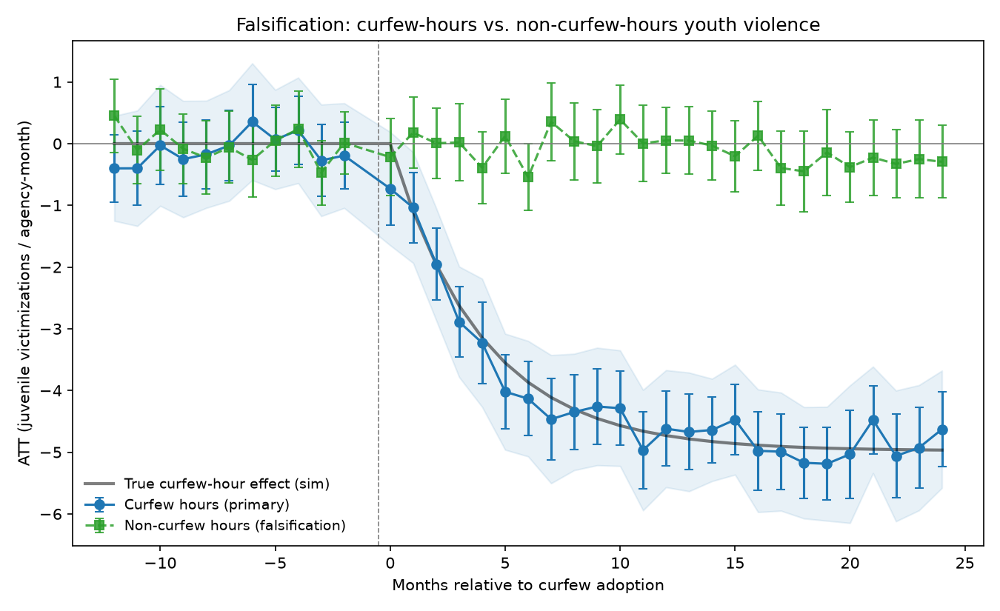
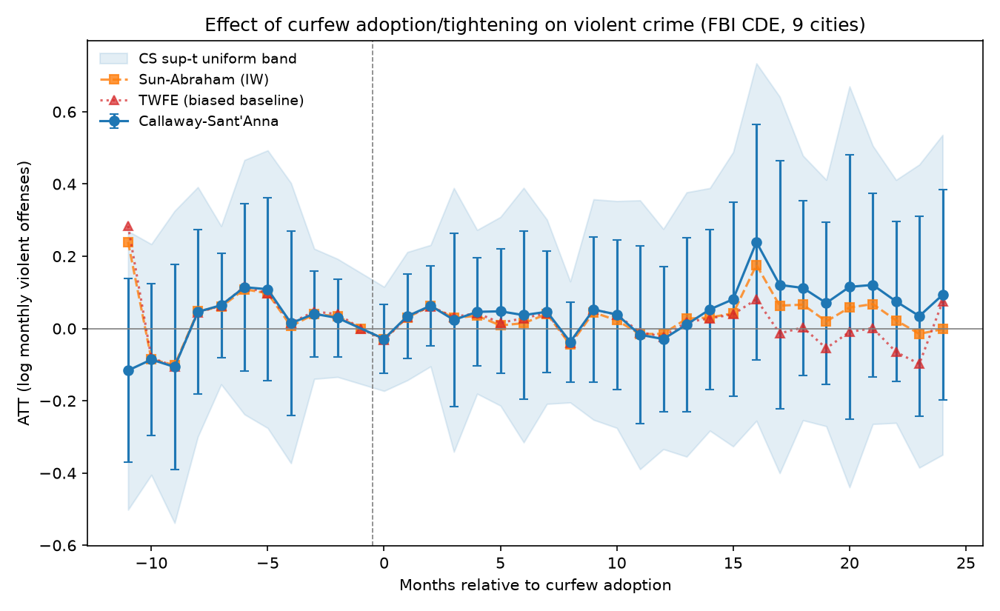

# City Curfews & Youth Violence — Staggered Difference-in-Differences

A reproducible pipeline for estimating the causal effect of municipal youth
**curfew** adoption/tightening on **youth violence**, using a multi-city panel
where cities adopt curfews at **different times** (staggered adoption).

## Why this design

Curfews are not adopted randomly — cities enact or tighten them *in response to*
rising youth violence, so naïve before/after comparisons are biased. With many
cities treated at different dates, the right tool is a **staggered DiD**, but
plain two-way fixed effects (TWFE) is itself biased here: under heterogeneous,
dynamic treatment effects it makes "forbidden comparisons" (already-treated
cities used as controls), as shown by Goodman-Bacon (2021) and Sun & Abraham
(2021).

This pipeline therefore uses modern estimators:

| Estimator | Role | File |
|---|---|---|
| **Callaway–Sant'Anna (2021)** | **Primary.** Group-time ATT(g,t), event-study & overall aggregations, clustered bootstrap with a sup-t uniform band, joint pre-trend test. | `src/curfew/estimators/callaway_santanna.py` |
| **Sun–Abraham (2021)** | Robustness. Interaction-weighted event study. | `src/curfew/estimators/sun_abraham.py` |
| **TWFE event study** | *Biased baseline*, shown only for contrast — never headlined. | `src/curfew/estimators/twfe.py` |

The CS estimator is implemented from scratch (no external DiD package) so it is
fully auditable, and it is **validated** against a simulation with a known
effect (`tests/test_estimators.py`): CS and Sun–Abraham recover the planted
dynamic ATT, while TWFE measurably does not.

## Quick start

```bash
pip install -r requirements.txt

# Offline: validate the estimators against a known synthetic effect (no API key).
python run.py --simulate

# Run the validation tests.
python tests/test_estimators.py        # or: pytest -q
```

Simulation mode writes `outputs/event_study.png` plus CSV tables and a
`summary.json`. The figure overlays CS, Sun–Abraham, biased TWFE, and the *true*
effect so you can see the estimators recover it.


It also runs the **curfew-hours falsification** (below): the simulated treatment
reduces *only* juvenile, curfew-hour violence, and the pipeline correctly finds
a strong effect in curfew hours and a null in non-curfew hours.



## Real-data results (FBI CDE, 2012–2024)

`config_real.yaml` runs the analysis on **real FBI Crime Data Explorer monthly
offense counts** (cached in `data/raw/cde_counts_2010_2024.csv` for
reproducibility):

```bash
python run.py --config config_real.yaml --outdir outputs_real
```

**Design.** 4 treated cities with web-verified curfew events — Baltimore
(ordinance, 2014-08), Chicago (citywide ordinance, first full month 2022-06),
Philadelphia (ordinance, 2022-07), Washington DC (zone enforcement pilot,
2023-09) — against 5 clean never-treated donors (Boston, Seattle, Denver,
Nashville, Louisville). Austin (curfew *repealed* 2017), Charlotte (tightened
2011), Columbus (zone curfew 2023) and Milwaukee (enforcement surge 2022) were
identified as contaminated donors and excluded; Portland and Minneapolis were
excluded for long reporting gaps. Outcome: log monthly violent offenses
(aggravated assault + robbery + homicide). Non-reporting months around the 2021
SRS→NIBRS transition are detected (< 20% of agency median) and interpolated;
the event window starts at e = −11 so no cell straddles Chicago's ~3× SRS→NIBRS
level break.



**Headline result: a precise null.** Overall ATT ≈ **+0.05 log points
(se ≈ 0.11)**; pre-trend sup-t test p ≈ 0.77 (parallel trends not rejected).
Consistent with the older curfew literature (Adams 2003; Kline 2012): no
detectable effect of curfew adoption/tightening on **total** violent crime.

**Robustness** (overall ATT, log points; cluster-bootstrap se; sup-t pre-trend p):

| Specification | ATT | se | pre-trend p |
|---|---|---|---|
| Main: 4 treated, not-yet-treated comparison | +0.051 | 0.106 | 0.765 |
| Excluding DC (3 ordinance changes only) | +0.097 | 0.100 | 0.098 |
| Never-treated comparison group | +0.062 | 0.094 | 0.608 |
| Baltimore cohort only | +0.204 | 0.092 | **0.000** |
| Chicago/Philadelphia/DC (2022–23) cohorts only | −0.014 | 0.098 | 0.288 |

The 2022–23 cohorts are a clean null. Baltimore *alone* shows a positive
coefficient — but its pre-trend test **rejects**, and its post window contains
the April 2015 unrest and subsequent homicide surge: that coefficient reflects
confounding by a co-occurring shock, not a curfew effect, and Baltimore fails
its own identification check. The pooled estimate is a null.

**Interpretation caution.** The outcome is *total* (all-age, all-hours) violent
crime — a low-power proxy. A genuine effect on juvenile, curfew-hours violence
could be diluted beyond detection here; the incident-level path (victim-age
join + curfew-hours falsification) is the right test and awaits NIBRS incident
extracts. Also: only 4 treated units (1 per cohort), so cluster-bootstrap
inference is fragile — placebo/permutation inference is the natural upgrade.

## Live data (real NIBRS / FBI CDE)

The outcome data come from the **FBI Crime Data Explorer (CDE)** API, the modern
gateway to NIBRS/SRS (`https://cde.ucr.cjis.gov/`).

1. Get a **free** key at <https://api.data.gov/signup/> and export it:
   ```bash
   export FBI_CDE_API_KEY=your_key_here
   ```
2. Fill in `data/curfew_policies.csv` (see below) with verified curfew dates and
   each city's **ORI** (originating agency identifier).
3. Optionally add never-treated **donor** cities' ORIs and a population file in
   `config.yaml`.
4. Run:
   ```bash
   python run.py --config config.yaml
   ```

If no API key is set, `run.py` automatically falls back to simulation mode.

## Juvenile outcome & curfew-hours falsification (incident-level)

Two outcomes need data the *summarized* CDE endpoint can't provide — victim age
and incident hour — so they run off **incident-level NIBRS extracts**:

- **Genuine juvenile outcome (victim-age join).** `nibrs_incidents.py` keeps only
  victims under 18 (`juvenile_max_age`), giving true juvenile victimization
  counts instead of total offenses scaled by an assumed share.
- **Non-curfew-hours falsification.** A curfew should suppress violence *during
  curfew hours* (e.g. 22:00–06:00), not during the day. The pipeline estimates
  the effect separately on curfew-hour and non-curfew-hour juvenile
  victimizations. A credible result is **negative in curfew hours and null in
  non-curfew hours**; a comparable non-curfew effect signals confounding (a
  general decline) rather than a curfew effect. `_falsification_verdict` encodes
  this as a pass/fail check, and the validation test confirms it recovers the
  right pattern on simulated incidents.

Provide an extract via `incident_file` in `config.yaml` (one row per
victim-incident: ORI, incident timestamp, victim age, offense). Source these
from the FBI CDE bulk downloads or NACJD/ICPSR NIBRS files. Without an extract,
the live pipeline falls back to the summarized total-offense outcome.

## The curfew-policy panel (hand-collected keystone)

`data/curfew_policies.csv` maps each city to the **effective month** of its
curfew adoption/tightening. This is the identification backbone and must be
collected and **verified** by hand. The shipped file is **seeded with a few
publicly documented events, all flagged `verified=False` with a `source_url`** —
they are starting points, not authoritative dates. The loader
(`src/curfew/policies.py`) warns loudly about unverified rows and can drop them
with `require_verified=True`.

Columns: `city, state, ori, policy_type, effective_month (YYYY-MM), source_url,
verified, notes`. `policy_type ∈ {adopt, tighten, loosen, repeal}`; `adopt`/
`tighten` define treatment onset.

## Known limitations (read before reporting numbers)

- **Juvenile-specific counts.** The CDE *summarized* endpoint returns *total*
  offense counts per agency-month. The genuine juvenile (age < 18) outcome and
  the falsification test therefore require **incident-level NIBRS extracts**
  (`incident_file`); see the section above. The summarized path remains
  available with a documented `juvenile_share` scaling assumption — but prefer
  the incident-level victim-age join when you have the data.
- **Curfew dates are hand-collected.** Verify every row before publishing.
- **Threats to validity** to check (see your research notes): displacement of
  violence to non-curfew hours, time-varying enforcement intensity, and curfews
  co-occurring with other youth-violence initiatives. The pre-trend test and a
  non-curfew-hours falsification outcome help, but cannot fully rule these out.
- **CDE schema drift.** `nibrs._extract_actuals` probes the common response
  shapes; if the API format has changed, inspect the raw JSON and extend it.

## Layout

```
curfew_youth_violence/
├── run.py                       # CLI entry point (simulate | live)
├── config.yaml                  # live-run settings
├── data/curfew_policies.csv     # curated curfew dates (verify before use)
├── src/curfew/
│   ├── nibrs.py                 # FBI CDE API client (summarized counts)
│   ├── nibrs_incidents.py       # incident-level: victim-age join + curfew hours
│   ├── policies.py              # load/validate the curfew panel
│   ├── panel.py                 # build balanced city×month panels + cohorts
│   ├── simulate.py              # staggered DGP (panel + incident-level) w/ KNOWN effect
│   ├── plots.py                 # event-study & falsification figures
│   ├── pipeline.py              # orchestration (summarized + incident-level)
│   └── estimators/              # CS, Sun–Abraham, TWFE
└── tests/
    ├── test_estimators.py       # validation: recover the known ATT
    └── test_falsification.py    # victim-age join + curfew-hours falsification
```

## References

- Callaway, B. & Sant'Anna, P. H. C. (2021). *Difference-in-Differences with
  multiple time periods.* J. Econometrics 225(2), 200–230.
- Sun, L. & Abraham, S. (2021). *Estimating dynamic treatment effects in event
  studies with heterogeneous treatment effects.* J. Econometrics 225(2),
  175–199.
- Goodman-Bacon, A. (2021). *Difference-in-Differences with variation in
  treatment timing.* J. Econometrics 225(2), 254–277.
