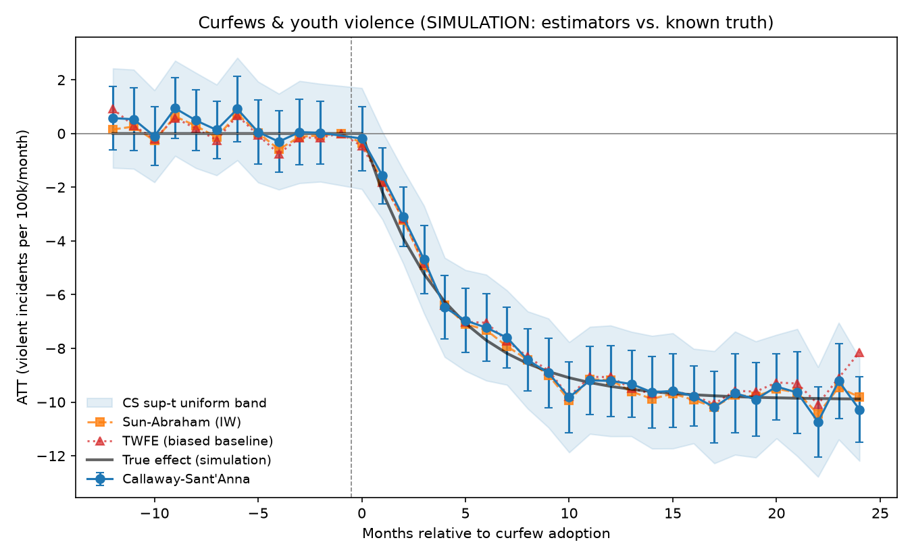

# City Curfews & Youth Violence — Staggered Difference-in-Differences

A reproducible pipeline for estimating the causal effect of municipal youth
**curfew** adoption/tightening on **youth violence**, using a multi-city panel
where cities adopt curfews at **different times** (staggered adoption).

## Why this design

Curfews are not adopted randomly — cities enact or tighten them *in response to*
rising youth violence, so naïve before/after comparisons are biased. With many
cities treated at different dates, the right tool is a **staggered DiD**, but
plain two-way fixed effects (TWFE) is itself biased here: under heterogeneous,
dynamic treatment effects it makes "forbidden comparisons" (already-treated
cities used as controls), as shown by Goodman-Bacon (2021) and Sun & Abraham
(2021).

This pipeline therefore uses modern estimators:

| Estimator | Role | File |
|---|---|---|
| **Callaway–Sant'Anna (2021)** | **Primary.** Group-time ATT(g,t), event-study & overall aggregations, clustered bootstrap with a sup-t uniform band, joint pre-trend test. | `src/curfew/estimators/callaway_santanna.py` |
| **Sun–Abraham (2021)** | Robustness. Interaction-weighted event study. | `src/curfew/estimators/sun_abraham.py` |
| **TWFE event study** | *Biased baseline*, shown only for contrast — never headlined. | `src/curfew/estimators/twfe.py` |

The CS estimator is implemented from scratch (no external DiD package) so it is
fully auditable, and it is **validated** against a simulation with a known
effect (`tests/test_estimators.py`): CS and Sun–Abraham recover the planted
dynamic ATT, while TWFE measurably does not.

## Quick start

```bash
pip install -r requirements.txt

# Offline: validate the estimators against a known synthetic effect (no API key).
python run.py --simulate

# Run the validation tests.
python tests/test_estimators.py        # or: pytest -q
```

Simulation mode writes `outputs/event_study.png` plus CSV tables and a
`summary.json`. The figure overlays CS, Sun–Abraham, biased TWFE, and the *true*
effect so you can see the estimators recover it.



## Live data (real NIBRS / FBI CDE)

The outcome data come from the **FBI Crime Data Explorer (CDE)** API, the modern
gateway to NIBRS/SRS (`https://cde.ucr.cjis.gov/`).

1. Get a **free** key at <https://api.data.gov/signup/> and export it:
   ```bash
   export FBI_CDE_API_KEY=your_key_here
   ```
2. Fill in `data/curfew_policies.csv` (see below) with verified curfew dates and
   each city's **ORI** (originating agency identifier).
3. Optionally add never-treated **donor** cities' ORIs and a population file in
   `config.yaml`.
4. Run:
   ```bash
   python run.py --config config.yaml
   ```

If no API key is set, `run.py` automatically falls back to simulation mode.

## The curfew-policy panel (hand-collected keystone)

`data/curfew_policies.csv` maps each city to the **effective month** of its
curfew adoption/tightening. This is the identification backbone and must be
collected and **verified** by hand. The shipped file is **seeded with a few
publicly documented events, all flagged `verified=False` with a `source_url`** —
they are starting points, not authoritative dates. The loader
(`src/curfew/policies.py`) warns loudly about unverified rows and can drop them
with `require_verified=True`.

Columns: `city, state, ori, policy_type, effective_month (YYYY-MM), source_url,
verified, notes`. `policy_type ∈ {adopt, tighten, loosen, repeal}`; `adopt`/
`tighten` define treatment onset.

## Known limitations (read before reporting numbers)

- **Juvenile-specific counts.** The CDE *summarized* endpoint returns *total*
  offense counts per agency-month, not victim-age-restricted counts. True
  juvenile victimization needs the NIBRS victim-demographic tables. As a
  first pass we use total violent offenses and expose a documented
  `juvenile_share` scaling assumption — **do not** report these as juvenile-only
  without the victim-age join.
- **Curfew dates are hand-collected.** Verify every row before publishing.
- **Threats to validity** to check (see your research notes): displacement of
  violence to non-curfew hours, time-varying enforcement intensity, and curfews
  co-occurring with other youth-violence initiatives. The pre-trend test and a
  non-curfew-hours falsification outcome help, but cannot fully rule these out.
- **CDE schema drift.** `nibrs._extract_actuals` probes the common response
  shapes; if the API format has changed, inspect the raw JSON and extend it.

## Layout

```
curfew_youth_violence/
├── run.py                       # CLI entry point (simulate | live)
├── config.yaml                  # live-run settings
├── data/curfew_policies.csv     # curated curfew dates (verify before use)
├── src/curfew/
│   ├── nibrs.py                 # FBI CDE API client
│   ├── policies.py              # load/validate the curfew panel
│   ├── panel.py                 # build balanced city×month panel + cohorts
│   ├── simulate.py              # staggered DGP with a KNOWN effect
│   ├── plots.py                 # event-study figure
│   ├── pipeline.py              # orchestration
│   └── estimators/              # CS, Sun–Abraham, TWFE
└── tests/test_estimators.py     # validation: recover the known ATT
```

## References

- Callaway, B. & Sant'Anna, P. H. C. (2021). *Difference-in-Differences with
  multiple time periods.* J. Econometrics 225(2), 200–230.
- Sun, L. & Abraham, S. (2021). *Estimating dynamic treatment effects in event
  studies with heterogeneous treatment effects.* J. Econometrics 225(2),
  175–199.
- Goodman-Bacon, A. (2021). *Difference-in-Differences with variation in
  treatment timing.* J. Econometrics 225(2), 254–277.
